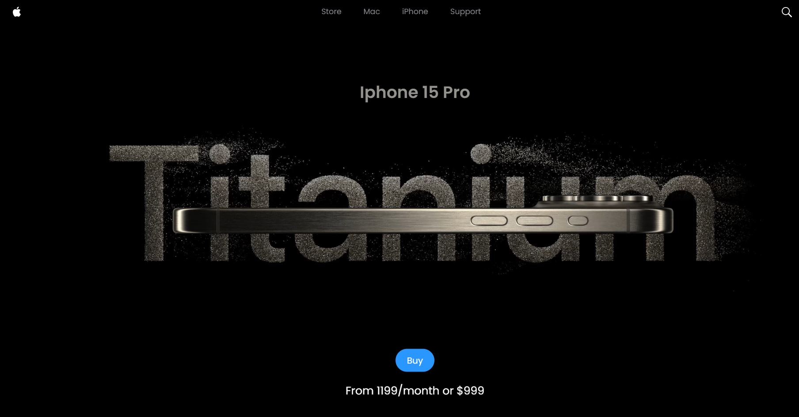

# Clone iPhone Website



A sophisticated and responsive replica of the iPhone product page, featuring 3D models, animations, and interactive elements. This project emphasizes performance, visual appeal, and an immersive user experience.

## 🚀 Tech Stack

- **React**: UI components
- **Next.js**: Server-side rendering, routing
- **Three.js**: 3D models and animations
- **Tailwind CSS**: Styling
- **Vite**: Build tool for faster development

## ✨ Features

- **Responsive Design**: Seamlessly adapts to different screen sizes
- **3D Models**: Interactive iPhone models powered by Three.js
- **Smooth Animations**: Eye-catching transitions and effects
- **Interactive UI**: Engaging components for better user interaction

## 📂 Project Structure

- **`src/components`**: Contains all the React components
  - **`Iphone.jsx`**: 3D model of the iPhone using Three.js
  - **`Model.jsx`**: Wrapper for 3D model handling
  - **`VideoCarousel.jsx`**: Carousel for product videos
  - **`Loader.jsx`**: Loading animation for the 3D model
  - **`animations.js`**: Utility functions for animations

## 📦 Installation

1. **Clone the repository**:
   ```bash
   git clone https://github.com/alexanderuk82/clone-iphone-website.git
   ```

or

## 📦 Installation

1. **Install dependencies**:
   ```bash
   npm install
   ```

## 🎮 Usage

Open your browser and navigate to http://localhost:3000 to view the app.
Interact with the 3D iPhone model and explore the product features.

## 🤝 Contributing

Contributions are welcome! Please feel free to submit issues and pull requests.

## 📝 License

This project is licensed under the MIT License.
